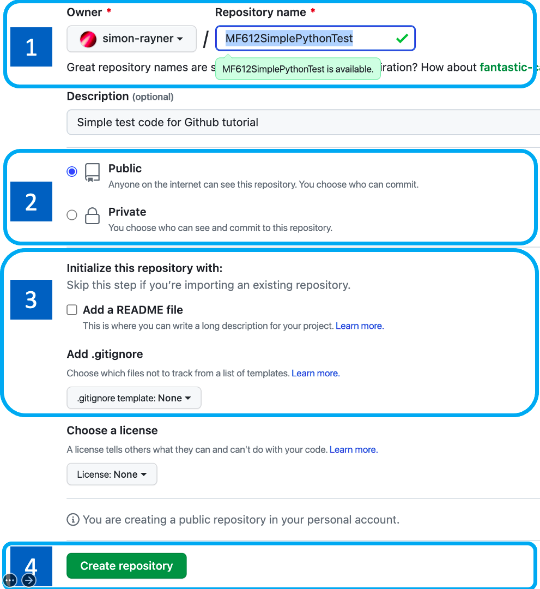
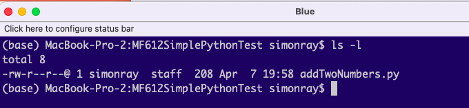
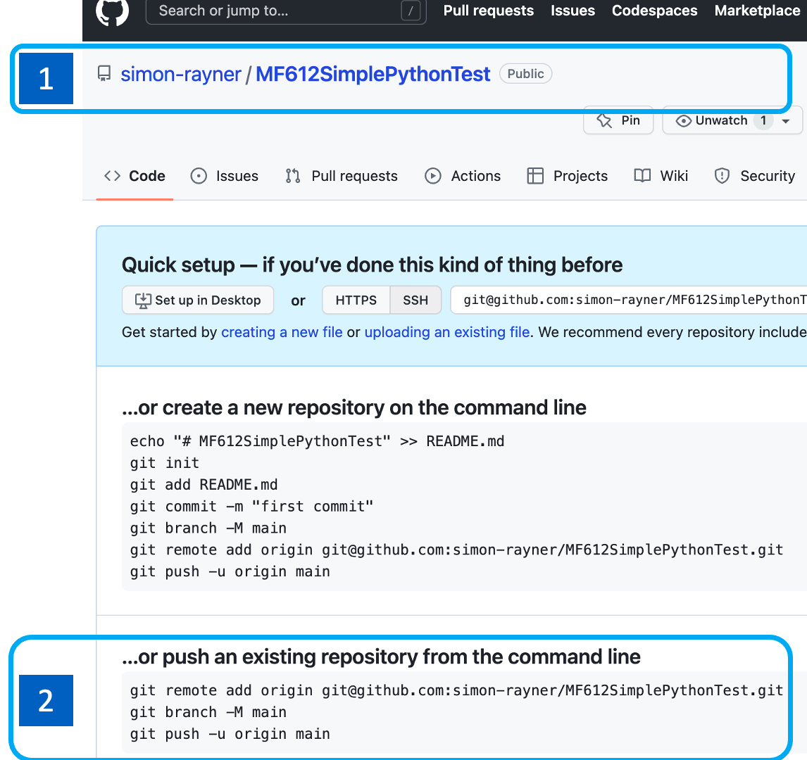
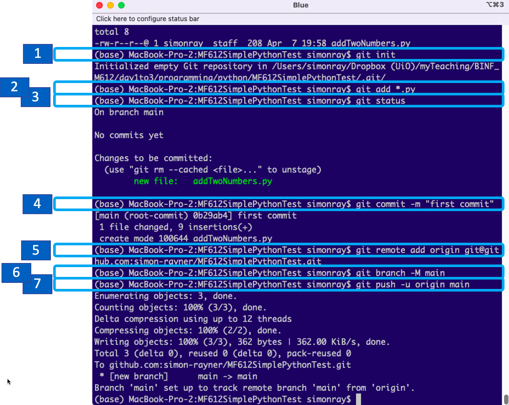
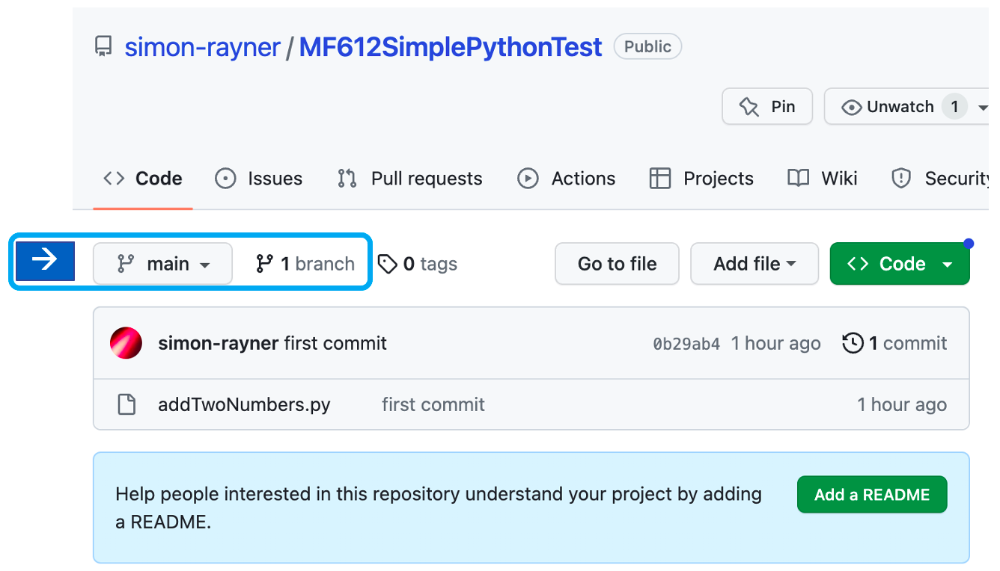
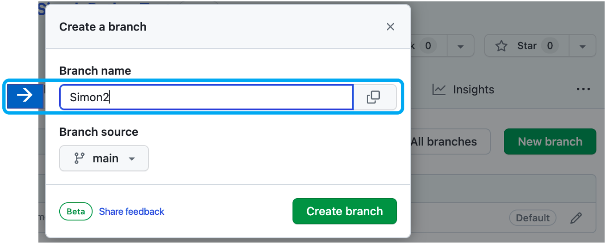
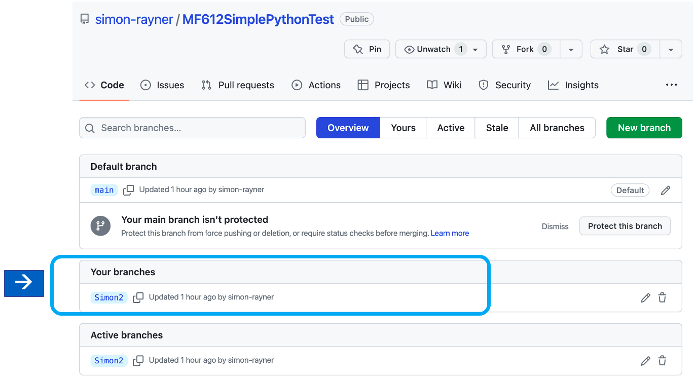
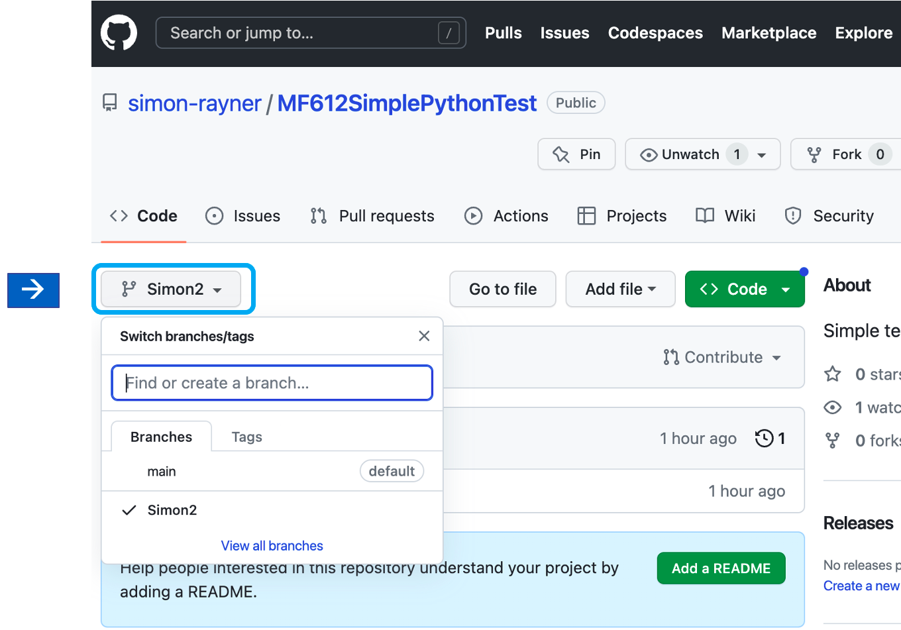
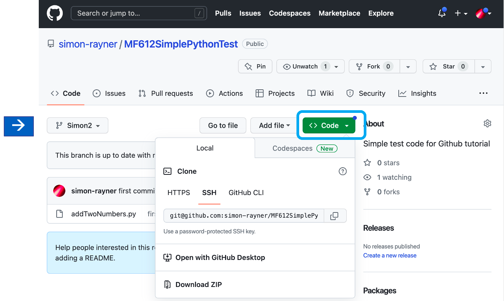

# Recap

## Java

### Setup

On the first day of class we tried running two compiled Java programs `GCCalc.java` and `CalcGC.java`. To run these programs, you needed to have the Java Runtime Environment (JRE) and the Java Virtual Machine (JVM) installed. These should come with your operating system, you can check by typing `java --version` 

for example, on my Macbook I get the following:

```
$ java --version
openjdk 11.0.11 2021-04-20
OpenJDK Runtime Environment AdoptOpenJDK-11.0.11+9 (build 11.0.11+9)
OpenJDK 64-Bit Server VM AdoptOpenJDK-11.0.11+9 (build 11.0.11+9, mixed mode)
```

you may get different results because you have different versions of the JRE/JVM installed on your system.

If you don't java installed, you will see something like 

```
Output
Command 'java' not found, but can be installed with:

sudo apt install default-jre
sudo apt install openjdk-11-jre-headless
sudo apt install openjdk-8-jre-headless
```

So just type in these commands to install

```
sudo apt install default-jre
sudo apt install openjdk-11-jre-headless
sudo apt install openjdk-8-jre-headless
```

Note: before you install any software, you should always update the package indices using `sudo apt-get update`. These are what linux uses to work out what other packages needs to be installed for the package to run. 

It's a bit like the instructions for building a bicycle. You have a list of parts that you need. 

For example:

####Bike Package List:

* frame:		(Brand-X RD-01 Road Bike Frameset)
* handlebars (SES Aero Road Handlebar)
* groupset (Shimano Dura-Ace Di2 R9270 12V groupset)
* saddle (S-Works Power Mirror Saddle)
* wheels (Fulcrum Speed 55 Comptz Disc Brake Carbon Wheelset)


But, supposing the wheels are not available ...


then you have to update the list with some wheels that in stock


####New Bike Package List:
* frame:		(Brand-X RD-01 Road Bike Frameset)
* handlebars (SES Aero Road Handlebar)
* groupset (Shimano Dura-Ace Di2 R9270 12V groupset)
* saddle (S-Works Power Mirror Saddle)
* wheels (Fulcrum Speed 55 C17 Brake Carbon Wheelset)

If this information is stored on the cloud, you need to check you have the most up to date parts list before you start building the bike, otherwise you will generate an error (you can't build the bike because you can't buy the wheels)

this is what the `sudo apt-get update` command does and that is why you should always run it before installing any new packages.

## Java run errors
Several of you were confused by some of the errors you encountered when trying to run `GCCalc.jar` and `CalcGC.jar`.

There were generally two types of errors

### Java couldn't find the jar file

```
$ java -jar software/GCCalc.jar -f /Users/simonray/DropboxUiO/myTeaching/BINF_M612/day1/data/oneseq.fa
Error: Unable to access jarfile software/GCCalc.jar
```

you gave the wrong path to the jar file.
If you specified the path to be

`software/GCCalc.jar`

then you should be able to find it if you type `ls software/GCCalc.jar`

For example:

```
$ls software/GCCalc.jar
ls: software/GCCalc.jar: No such file or directory
```
#### Relative vs Absolute Paths

`software/GCCalc.jar` is a relative path. it is the location of the file relative to where you are in the file system within the terminal

For example, if i check my current working directory

```
$ pwd
/Users/simonray/DropboxUiO/myTeaching/BINF_M612
```

then 

```
$ java -jar software/GCCalc.jar
```

is specifying a location *relative* to the working directory and java will look for a file in the location `/Users/simonray/DropboxUiO/myTeaching/BINF_M612/` + `software/GCCalc.jar`, i.e.,

```
`/Users/simonray/DropboxUiO/myTeaching/BINF_M612/software/GCCalc.jar
```

but on my computer `GCCalc.jar` is located at

```
`/Users/simonray/DropboxUiO/myTeaching/BINF_M612/day1/software/GCCalc.jar
```

so, i either need to specify the correct *relative* path 

```
$ java -jar day1/software/GCCalc.jar -h
```

or specify the *absolute* path to the file

```
$ java -jar /Users/simonray/DropboxUiO/myTeaching/BINF_M612/day1/software/GCCalc.jar -h
```

### Java couldn't find the input file
This is exactly the same problem, but the error isn't so easy to see in the error message

```
$ java -jar day1/software/GCCalc.jar -f /Users/simonray/DropboxUiO/myTeaching/BINF_M612/day2/data/oneseq.fa
GCCalc
initializing
parse arguments
fasta input file is </Users/simonray/DropboxUiO/myTeaching/BINF_M612/day2/data/oneseq.fa>
  here ! ==>   java.io.FileNotFoundException: /Users/simonray/DropboxUiO/myTeaching/BINF_M612/day2/data/oneseq.fa (No such file or directory)
	           at java.base/java.io.FileInputStream.open0(Native Method)
	           at java.base/java.io.FileInputStream.open(FileInputStream.java:219)
	           at java.base/java.io.FileInputStream.<init>(FileInputStream.java:157)
	           at java.base/java.io.FileReader.<init>(FileReader.java:75)
	           at no.ous.compbio.sequence.GCCalc.loadFAFile(GCCalc.java:76)
  line num ==> at no.ous.compbio.sequence.GCCalc.main(GCCalc.java:156)
	           at java.base/jdk.internal.reflect.NativeMethodAccessorImpl.invoke0(Native Method)
	           at java.base/jdk.internal.reflect.NativeMethodAccessorImpl.invoke(NativeMethodAccessorImpl.java:62)
	           at java.base/jdk.internal.reflect.DelegatingMethodAccessorImpl.invoke(DelegatingMethodAccessorImpl.java:43)
	           at java.base/java.lang.reflect.Method.invoke(Method.java:566)
	           at org.eclipse.jdt.internal.jarinjarloader.JarRsrcLoader.main(JarRsrcLoader.java:61)
```
	
the problem is the same. You gave the wrong *relative* or *absolute* path to the input file.


## File locations

we agree we need to decide on some standards for file locations. This is good practice

# More GitHub Stuff

Before we jump into the Java code, I want to try one more simple exercise with GitHub. On day 1, you 'cloned' my code from my GitHub repository. Today you are going to try and create your own repository and push some code.

Since you are more familiar with Python, let's work with this language.

## Set up a repository on your computer

1. create a new folder for your Python project and go to this folder
2. type in the following simple program

   ```
   # Enter two numbers 
   n1 = input('Enter number 1: ')
   n2 = input('Enter number 2: ')

   # Add them together
   sum = float(n1) + float(n2)

   # Display the result
   print('The sum of {0} and {1} is {2}'.format(n1, n2, sum))
   ```
3. Test your code to make sure it works
4. create a new repository

   ```
   git init
   ```
5. Add the files in the folder to the repository 

   ```
   git add
   ```
   (you can also specify subsets (e.g. `git add *.py`)

6. Optional: Add a `.gitignore` file to tell git which files you don’t want to track. 

   ```
	git add .gitignore
   ```
   
7. Commit your changes

   ```
	git commit -m "first commit"
   ```
   
## Create a new repository on GitHub

1. Go to github.com and log in to your account.
    
2. Click on the **Repositories** tab new repository button in the top-right. 
   

This will bring up the **Create a new repository** tab
   

1. Enter a name for the repository. **NOTE: This has to be the same name as your folder**. 

For example, i created a folder called `MF612SimplePythonTest`       for my program, so i have to call the new repository `MF612SimplePythonTest`
   

2. You can choose `Public` or `Private` 
   If you select `Private` you can invite people later by sending them an email. 
    
3. Do not choose to initialize the repository with a `README` or `.gitignore` file. If you do, it can confuse the initial synchronisation when you first push your code.

4. click on the **Create repository** button


### Push your code from your computer to your new repository

This will create your new repository and you will now see something like the following window



1. your repository name is at the top

2. you want to push an existing repository from your computer, so type the highlighted instructions into your terminal window

This is what happens when I 'init' my repository,'add' the python files, 'commit' and then 'push' to github



### Next Steps

You are working in pairs, or trios, so once you have created your project and pushed it to your account you are going to do the following

 * 'clone' your partners code by 'branching' it
 *  modify the code
 * push it back to their repository
 
To make a branch, you need to click on the 'branch' tab



then give the new branch a name and click ion **create branch**



Now you can see a new branch in the repository



You can switch between branches by clicking on the button on the top left:



and clone by clicking on the clone button on the top right as you did previously


After you branch and clone your partner's code, you can push it back to their repository. This allows you to work on the code separately and later you can merge your changes.

**Note** for this to work effectively, you have to plan code changes with your partners. For example, decide who is going to work on which part of the code.

#### Task
Go ahead and try all the above. your code change can be whatever you want. For example, add a third number, multiple the numbers...


## Eclipse
We installed Eclipse for code development. We haven't had a chance to use it yet, but some of you ran into problems with having the wrong version of the Java compiler

### Eclipse setup
Some of you installed the wrong version of Eclipse. you need the version that includes Java. Some of you installed the C/C++ version - if you did, you need to reinstall Eclipse, you can't use this version with Java.

